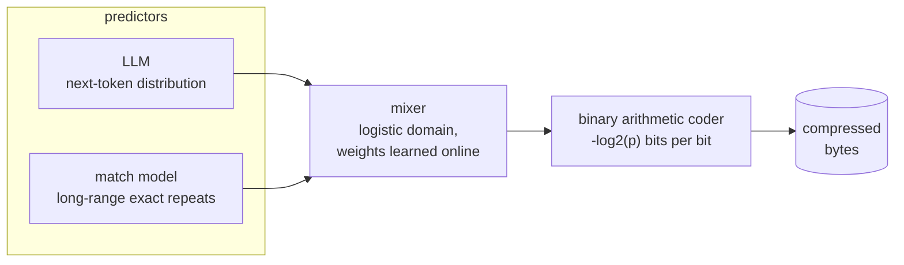

# An honest lab for compression

One method: measure the incumbent properly, then find out whether there is anything left
to win.

**Can a language model beat the general-purpose compressors?** Two lossless compressors
sharing one arithmetic coder. Result: **0.915 bpb on `alice29.txt`**, 2.79× smaller than
`xz -9`, round-trip verified on the whole file. Real, and almost entirely down to the
*model* rather than to any of our engineering — which is the finding, not a disclaimer.

The other half of this project asked whether *structure* can beat them instead, and now
lives in **[sql-compression](https://github.com/BeForce1/sql-compression)**.

**The code:**

- **`ptc.py`** — pure context mixing. No weights, no training, no model file. ~250 lines of Python, lossless on arbitrary bytes.
- **`llm_ptc.py`** — the same coder, driven by a pretrained language model plus a long-range match model, blended by a learned mixer.
- **`bench.py`** — the harness. Verifies round-trip per row, reports bits per byte, and reproduces published `xz -9` numbers to three decimals so its other numbers can be trusted.

Everything below was measured by this code on a laptop CPU with no GPU. Figures quoted
from other people's work are labelled as such. **The negative results are the most useful
part of this repo** — sixteen predictions were refuted by measurement, and they are all in
[§ What didn't work](#what-didnt-work).

---

## Headline

On `alice29.txt` (152,089 bytes) — every codec on the identical file:


| codec | size | bits/byte | vs ours |
|---|---:|---:|---:|
| llm_ptc + SmolLM2-360M *— measured, not decoded* | 15,179 | 0.798 | −13% |
| **llm_ptc + SmolLM2-135M** | **17,400** | **0.915** | — |
| llm_ptc + SmolLM2-135M *— batched, the like-for-like baseline* | 17,406 | 0.916 | +0.03% |
| ts_zip (RWKV-169M) *— published* | ~21,711 | 1.142 | +25% |
| llm_ptc + GPT-2 124M | 34,868 | 1.834 | +100% |
| `bz2 -9` | 43,202 | 2.272 | +148% |
| `brotli -q 11` | 46,487 | 2.445 | +167% |
| `xz -9` | 48,492 | 2.551 | +179% |
| `ptc` (pure maths, this repo) | 49,543 | 2.606 | +185% |

**2.79× smaller than `xz -9`**, and 19.9% smaller than the published ts_zip figure on the
same file — using a 272 MB model on CPU. That row is a **verified round-trip on the whole
file**, not an entropy measurement; what it cost to get there is the next section.

The 360M row above it is bolder and softer at once: **0.798 bpb / 15,179 B, 10.0× versus
raw and 3.19× versus `xz -9`**, measured 2026-08-23 on the whole file at 409 B/s. It is a
*batched* measurement, so it sits exactly where 0.939 used to — real, and not decodable.
It is not the headline until it round-trips.

**The comparison behind that −13% is now supported rather than assumed.** It used to pit a
batched run against a sequential one, which this repo's own rule forbids. The missing cell —
135M, batched, `LIMIT=8192`, whole file — measures **17,406 B / 0.916 bpb**, so the
like-for-like figure is **−12.79%** against the −12.76% previously quoted. The cross-path
comparison was harmless, which nobody could have known without running it.

Two things fell out of that run. The batched path is **6 bytes, 0.034%** from the verified
sequential figure here, against 27 bytes / 0.15% at `LIMIT=1024` — it got *more* faithful
with more context, not less. And the baseline this repo had on file for that configuration
was **0.934**, from a 65,536 B sample; on the whole file it is 0.916. bpb improves with file
size, so quoting the sample figure would have inflated the 360M gain to ~14.6%.

### What is *measured* versus what is *decodable*

These are not the same thing, and for most of this project's life the headline was on the
wrong side of the line. The number used to come from the batched encoder, which is 16×
faster but whose stream **does not round-trip** through the sequential decoder (it diverges
at byte 253, because batched and single-token GEMMs reduce floats in a different order).
That made 0.939 an *entropy measurement* wearing a codec's clothes.

A full sequential encode **and decode** of the whole file has since closed that gap:

| | largest **verified** round-trip | compression |
|---|---:|---:|
| `ptc.py` | **1,029,744 B** — any size, any bytes incl. binary | **3.1×** |
| `llm_ptc` + SmolLM2 | **152,089 B** — whole of `alice29.txt` | **8.74×** |

The verified figure is **0.915 bpb / 17,400 B**, re-run 2026-08-03 at the shipped defaults
after the context sweep moved `LIMIT` from 1024 to 8192. It supersedes 0.940 / 17,873 B,
which was the same code and model on the same file at the old default — **473 bytes, 2.65%,
bought by one changed constant.** Two things still hold:

1. **The batched measurement was honest** — 27 bytes, 0.15%, at LIMIT=1024. But that figure
   is specific to `alice29`: on post-cutoff text the same path reads 0.5% off the sequential
   one. Quote it as an alice29 result, not a property of the path.
2. **"Verified" still means *same machine, same thread count, same library versions*.** It
   is a verified round-trip, not a portable format, and no amount of further running fixes
   that. Making it portable is the [int8 determinism task](Long_Time_Tests.md).

The run reported **32 B/s encode and 34 B/s decode** — an idle machine, whole file, nothing
else running. These are the first throughput figures here that are neither contended nor
inflated by a sample barely larger than `LIMIT`, and they refute something: a 40,960 B test
had measured decode at a third of encode, and the plausible mechanism for that (KV-cache
pressure at 8192) was wrong. Decode is marginally *faster*. The gap was tooling running on
the same box — trap 6 again, committed again by the person who wrote trap 6.

### And the number that keeps the 8.74× honest

Against `xz` we save ~0.204 bytes per input byte, so a 272 MB model repays itself after
about **1.33 GB of text** — which at the measured 32 B/s takes **481 days** to read back.
The break-even exists on paper and is unreachable in practice. Quote the ratio with that
attached, or don't quote it.

Note which way that moved. The better ratio made the practicality *worse*: the old default
broke even after ~180 days at 87 B/s, and buying 2.65% of ratio with 2.7× of speed pushed
it to 481. Both are unusable, so the ratio is the deliverable — but the tradeoff is real
and it is not in this project's favour.

Also worth reading: `alice29.txt` is public-domain text the model has almost certainly
memorised. See [§ Is it compression, or memorisation?](#is-it-compression-or-memorisation)

### The harness validates itself

Before trusting any of the above, `bench.py`'s own `xz -9` measurement is checked
against the published figure on the identical file:

| file | our `xz -9` | published `xz -9` |
|---|---:|---:|
| alice29.txt | **2.551** | 2.551 |
| book1 | **2.717** | 2.717 |

Three decimals, two files. That check is why the rest of the numbers mean anything.

---

## How it works

Both compressors are the same shape. Compression *is* prediction: an arithmetic coder
spends `-log2(p)` bits on each outcome, so the file size is exactly the model's total
surprise. Nothing is copied, there's no dictionary and no code table.



**Why a mixer and not a blend.** The mixer starts at full trust in the LLM and zero in
everything else, so adding a predictor can only help — a useless input gets weighted
out. My first attempt blended the match prediction into the LLM's distribution by linear
interpolation and it measured **2% worse**, because interpolation steals probability mass
from the LLM even when the LLM is already right. That property is the whole reason the
architecture is extensible.

**Why the token id is binarised.** The coder is binary and verified. Rather than write a
multi-symbol range coder and its edge cases, `llm_ptc` walks the token id down its
binary tree, reading each decision's probability off the model's cumulative
distribution. Exact, and no new coder to get wrong.

---

## The model is almost everything

Same coder, same 8 KB sample, same context budget. Only the model changes:


| model | params | bits/byte | speed | on disk |
|---|---:|---:|---:|---:|
| **SmolLM2-135M** (base) | 135M | **0.990** | **69 B/s** | **272 MB** |
| Qwen3-0.6B (instruct) | 600M | 1.110 | 23 B/s | 1,519 MB |
| GPT-2 124M (base) | 124M | 1.821 | 41 B/s | 551 MB |

**Finding 1 stands. Finding 2 was wrong, and the table above is retired.**

1. **Training data beats parameter count.** SmolLM2-135M has essentially the same
   parameter count as GPT-2 124M and compresses **45.6% better**. Same size, ~1000× the
   training tokens. This comparison was fair — 1024 is GPT-2's *maximum* context, so both
   models sat at a real ceiling.
2. ~~**Bigger lost.**~~ **Retired 2026-08-03.** The Qwen3 row stacked three handicaps on
   the loser: it was the **instruct** checkpoint, at `LIMIT=1024` against a **32,768**-token
   native context, on a benchmark the winner had memorised. Re-run fairly, it wins.

Both hypotheses offered for "why bigger lost" were testable, and one of them was right:

| tested at matched sample and `LIMIT` | result |
|---|---|
| **base beats instruct** | **confirmed** — Qwen3-0.6B-Base vs instruct: **−16.7%** on alice29, **−14.6%** on arXiv |
| **bigger loses** | **refuted** — SmolLM2 135M → 360M is **−13%**, consistently, at every context and on every corpus |
| big vocabulary wastes capacity | still untested; needs `gemma-3-270m`, which is a gated repo |

For scale, and this is the finding rather than a disclaimer: **swapping the model was worth
45%; a bigger sibling is worth another 12.8%; using the base rather than instruct checkpoint
is worth 15%. Every hand-built modelling improvement in this repo, combined, is worth about
1%.** The 12.8% is now a whole-file, like-for-like figure — 360M against 135M on the same
batched path at the same `LIMIT` — rather than the 65 KB sample it used to rest on. The full fair-context matrix is in
[`results.json`](results/results.json) under `model_comparison_2026_08_03`.

---

## Is it compression, or memorisation?

`alice29.txt` is public-domain literature. Any modern model has read it. So the headline
number is suspect, and the honest test is text written *after* the model's training
cutoff — here, prose from a 2026 arXiv paper. **`xz` is the control: it cannot memorise,
so an advantage that survives against `xz` is real.**


| corpus (50,757 bytes each) | llm_ptc | `xz -9` | advantage |
|---|---:|---:|---:|
| alice29 — likely memorised | 0.972 | 2.881 | **2.96×** |
| post-2026 arXiv — definitely unseen | 1.338 | 2.844 | **2.13×** |

That looked like the fingerprint of familiarity: `xz` scores nearly identically on both
files (2.881 vs 2.844), so they have comparable dictionary-level redundancy, yet the model
finds alice29 far easier. The README used to call the 38% gap memorisation, while noting
genre as a partial confound.

**It was the confound. Measured 2026-08-03 by adding a second unseen corpus that is
*narrative* rather than technical** — Wikinews articles from 2026, same 50,757 bytes, same
`LIMIT`, so genre is the only thing that moves:

| bpb, 50,757 B each | alice29 *memorised, narrative* | news 2026 *unseen, narrative* | arXiv 2026 *unseen, technical* |
|---|---:|---:|---:|
| SmolLM2-135M | 0.961 | 0.966 | 1.260 |
| SmolLM2-360M | **0.836** | **0.884** | 1.105 |
| Qwen3-0.6B-Base | 0.897 | 0.890 | **0.970** |
| `xz -9` | 2.881 | 3.056 | 2.844 |

| moving from → to | 135M | 360M | Qwen3-Base |
|---|---:|---:|---:|
| **memorised → unseen**, genre held | **+0.52%** | +5.74% | **−0.78%** |
| **narrative → technical**, both unseen | +30.4% | +25.0% | +9.0% |

**The penalty for never having seen the text is between −0.8% and +5.7%.** Normalised
against `xz` — which absorbs how compressible each file intrinsically is — all three models
score *better* on the unseen file than the memorised one. The 25–30% cliff sits entirely on
the narrative→technical axis. Qwen3-Base is actually **better** on text published after its
own training cutoff than on *Alice in Wonderland*.

Two things this does and does not license. It does **not** show `alice29` is unmemorised —
it shows memorisation buys no measurable advantage over comparable unseen prose, which is a
different and more interesting claim. And genre is only *roughly* controlled: Victorian
fiction against 2026 journalism is two narrative genres, not one. The clean experiment
needs post-cutoff **fiction** under a redistributable licence, which is genuinely hard to
obtain — that is the honest limit here.

**The number to quote for unseen prose is ~0.89 bpb on narrative and ~0.97 on technical**
(SmolLM2-360M and Qwen3-0.6B-Base respectively, at `LIMIT=2048`), against 2.88–3.06 for
`xz`. The old single figure of 1.34 was one genre, one model, and one context length.

---

## What actually helped

Ablation on a 262,144-byte slice from **offset 50,000,000** of `enwik8` — mid-file on
purpose, see the caveat below.


| config | bits/byte | speed |
|---|---:|---:|
| LLM only | 0.928 | 1,088 B/s |
| **+ match model, order 4** | **0.917** | 1,056 B/s |
| + match orders 2,4,6,8 | 0.915 | 789 B/s |
| + APM/SSE at 25% weight | 0.918 | 1,062 B/s |
| + APM/SSE at 75% weight | 0.926 | 887 B/s |

**Only the match model pays.** It's worth −1.2%, and it pays because it supplies
information the LLM *structurally cannot have*: exact repeats beyond its context window
(1024 tokens when this was measured, 8192 since). Extra match orders buy 0.2% for 25% of
the speed. **SSE/APM — the stage every serious context-mixing compressor has — measured
neutral to harmful.**

There's a coherent reason, and it's the most transferable finding here. SSE exists to fix
a *miscalibrated* mixer. `probe.py` measures this LLM as well-calibrated (12-bit
quantisation is worth +0.05%), so there is nothing to recalibrate and the APM's own
estimation noise costs more than it saves. **Against a strong neural predictor, classical
CM machinery mostly adds noise.** That also explains why the 2026 literature gets its
gains from ensembling models rather than piling on contexts.

> A first attempt measured 0.811 bpb on the **first** 256 KB of enwik8. That slice
> contains the XML preamble and `<siteinfo>` boilerplate, which inflated the result by
> **13%**. Always slice mid-file.

---

## The coder is not the bottleneck

`probe.py` separates three quantities: the model's own entropy, the entropy under the
12-bit probabilities we actually code against, and the bits we really emit.

| model | raw model | quantised | emitted | coder waste | quantisation effect |
|---|---:|---:|---:|---:|---:|
| GPT-2, ctx 1024 | 1.993 | 1.888 | 1.902 | 0.77% | **−5.29%** |
| SmolLM2-135M, ctx 1024 | 0.990 | 0.990 | 1.008 | 1.79% | +0.05% |

Two results worth having:

- **The arithmetic coder wastes under 1%** of what it's given (the 1.79% row is mostly
  the fixed 64-bit header on a 4 KB sample; on a real file it's ~0.04%). So rewriting it
  in C would buy *ratio* essentially nothing.
- **12-bit quantisation makes GPT-2 5.3% smaller.** That looked impossible at first —
  no coder beats the entropy of its own distribution. The explanation is that the clamp
  *smooths* an overconfident model, capping the damage when GPT-2 is confidently wrong.
  Classic probability smoothing, obtained accidentally from a fixed-point implementation
  detail. Against well-calibrated SmolLM2 the same clamp is worth nothing.

---

## The whole tradeoff


Four orders of magnitude of speed buys about 2.7× of ratio. **There is no
fast-and-best corner**, and that isn't an engineering gap — better prediction requires
consulting a larger model of the language, once per symbol. For reference, the best
known text compressor (`fx2-cmix`, the Hutter Prize record) reaches 0.886 bpb on enwik9
and needs days of compute; Shannon-era estimates put English at roughly 1.0–1.3 bits per
character. **The remaining headroom in text compression is small and the ceiling is
visible.**

---

## ptc: the pure-maths compressor

No model, no weights, no training data, lossless on arbitrary bytes including binary.
Five predictors — order-1/2/4 byte contexts, a match model, and a stride detector that
votes continuously on record width — blended by the same kind of learned mixer.


The stride detector was added because the harness identified a specific blind spot:
`kennedy.xls` is a spreadsheet of fixed-width records, and byte-order contexts are
structurally blind to stride-8 alignment. Predicted in advance that it would gain most —
it gained 20%, the largest of the four files.

`ptc` beats `zlib -9` on all four corpus files and beats `xz -9` on `book1`. It loses to
`xz` badly on `kennedy.xls` (0.787 vs 0.382), because LZMA's 64 MB window finds
megabyte-scale duplicates while `ptc` tracks a single unverified match candidate.

---

---

# Part 2 lives in its own repo now

The format-aware transforms — SQL dumps, SQLite files, OCI layers — moved to
**[sql-compression](https://github.com/BeForce1/sql-compression)** on 2026-08-01, with
their measurements, their refutations and their git history. They shared a method with this
repo and nothing else: no shared code, no shared data, and a name that described half the
contents.

The comparison between the two halves is worth keeping in mind here, though, because it is
the most useful thing either produced:

| lever | worth |
|---|---|
| swapping the language model | **45%** |
| every hand-built modelling improvement in this repo, combined | **~1%** |
| a codec flag, over there | more than an afternoon of transform code |

---

## What didn't work

Kept deliberately, because a repo that only reports its wins isn't a measurement lab.

| prediction | outcome | what actually happened |
|---|---|---|
| bf16 weights will be ~2× faster — the checkpoint is 16-bit and we're bandwidth-bound | **refuted** | 64 vs 84 B/s, *slower*. No AVX512-BF16 on this CPU, so torch converts to fp32 per matmul and we pay conversion on top. |
| Qwen3-0.6B-Base generalises better to unseen text (it beat SmolLM2-360M by 12.2% on unseen arXiv prose) | **refuted by a genre control** | On unseen *narrative* it loses to the same model by 0.7%. The advantage is affinity for technical prose, not generalisation — and one unseen corpus in one genre could not tell those apart. |
| unseen text costs ~38%, and that gap is memorisation | **refuted** | Holding genre constant it costs −0.8% to +5.7%. The cliff is narrative→technical, not memorised→unseen. |
| bigger models lose (Qwen3-0.6B vs SmolLM2-135M) | **refuted — three handicaps on one row** | instruct checkpoint, 1/32 of its context, contaminated benchmark. Run fairly, bigger wins. |
| the gap to ts_zip is mostly our 512-token context resets | **refuted, then the refutation was too** | Sweeping context 256→1024 moved GPT-2's bpb by −0.7%. But 1024 *is* GPT-2's maximum, so that measured a ceiling and called it a property of context. Swept properly on SmolLM2 to its native 8192: **−2.5% on alice29, −11.3% on unseen text.** "The gap was the model" is still right about ts_zip; "context barely matters" was never measured. |
| blending a match prediction into the LLM will help on repetitive markup | **refuted as written** | Linear interpolation measured 2% worse. Re-doing it as logistic mixing with learned weights then gave −1.2%. |
| 12-bit probability quantisation costs ratio | **inverted** | It *gains* 5.3% against GPT-2 by smoothing an overconfident model. |
| SSE/APM will help, as it does in every serious CM compressor | **refuted** | Neutral at 25% weight, harmful at 75%. Nothing to recalibrate. |
| batched teacher-forced encoding is a free 16× speedup | **partial** | 16× faster, byte-identical output — but the stream does **not** decode with the sequential decoder. Diverged at byte 253. |
| the first 256 KB of enwik8 is a representative sample | **refuted** | 0.811 there vs 0.917 mid-file. XML preamble, 13% bias. |
| the lockstep window-slide works at S>1 — it's the same code the sequential path has run all along | **refuted, by reading rather than running** | It had never *executed* at S>1. Every lockstep test was 8–32 KB, where a segment never reaches `LIMIT`. The first run big enough to slide would have asked for **12.0 GiB** of logits at S=16. Fixed with `logits_to_keep=1`; 12.0 GiB → 3.0 MiB. |
| that fix will change the format, since a different `lm_head` GEMM reduces floats in a different order | **half-refuted** | Streams measured **byte-identical** at S=1 and S=4 — but the logits underneath differ by ~4e-5 and ~7% of probability buckets move. One sample agreeing is not compatibility. Treat it as a format change. |
| sweeping `LLM_PTC_THREADS` for lockstep will find another free multiple, as it did for sequential | **refuted — the inherited default was right** | 4 threads 350 B/s, 6 **288**, 8 276, 12 269, 20 205. The *sequential* shape, so the shipped 6 is near the top. The obvious change — give it every core, as `compress_batched` wants — would have cost **1.71×**. |
| the 135M batched baseline will land near 0.934, the figure already on file for that config | **refuted** | 0.916. The recorded figure was a **65,536 B sample**, and bpb improves with file size — quoting it would have inflated the 360M gain from 12.8% to ~14.6%. Trap 2 with only one config, which is easier to miss than the two-config version. |
| rewriting `ptc.py`'s hot loops (unrolled contexts, `__slots__`, inlined helpers) is worth 1.35× | **refuted by interleaving** | 1.35× run A-then-B, **1.00×** run A,B,A,B on an idle box. The first measurement was cache state. Reverted. |
| the shipped defaults are the measured optimum, as the README said | **refuted** | `LLM_PTC_THREADS` was `os.cpu_count()` and had never been swept. It was the *slowest* of five settings — 42 B/s vs 87 at 6 threads, **2.07×** paid on every run in the project's life. |


Three more — SQLite page grouping, the Docker layer, and the `wiki.sql` parser — moved with
their code to [sql-compression](https://github.com/BeForce1/sql-compression) and are listed
there rather than duplicated here.

Two instrument bugs were also caught by sanity checks rather than by luck: a
cost-bucketing bug in `probe.py` that put the *start of the file* in the "post-slide"
bucket (GPT-2 has Alice's opening lines memorised, which produced a nonsensical result),
and the enwik8 header bias above. **A surprising measurement is more often a broken
instrument than a discovery.**

---

## The thread count is part of the format

Found on 2026-08-31 by a sweep that was looking for something else, and it is the sharpest
failure mode this repo has produced.

`compress_lockstep` output varies with `torch.get_num_threads()`: 16,384 B at S=4 encodes to
**2,209 B at 4/6/8 threads and 2,210 B at 12/20**, consistently. Different size means
different bytes, and cross-decoding them does not fail loudly — it returns **8,692 bytes for
an 8,192-byte input** one way and 8,320 the other, with **no exception raised**. The token
count in the header is correct, so the decoder runs to completion and hands back
plausible-looking garbage.

It was found because the sweep logged output size per run, which it had no reason to do.
Nothing in the test suite would have caught it: every round-trip encodes and decodes in one
process at one thread count, so the two sides always agreed.

The thread count is a header byte now, restored at decode. It is self-healing rather than
fail-loud because it can be — `set_num_threads` after the model loads does take effect here
and reproduces a byte-identical stream — and it is still checked afterwards, because that is
an OpenMP build detail rather than a promise.

**The general lesson is the one in caveat 3 below, made concrete.** "Verified means this
machine" was already written down. What that actually cashes out to is that *thread count*
is as much a part of this format as the model weights are, and until today it was the only
part not written into the stream.

---

## Caveats, read these

1. **The headline is verified, but only on one machine.** The whole of `alice29.txt`
   round-trips through the sequential path at 0.915 bpb. What that does *not* buy is
   portability: decoding needs the same machine, thread count and library versions, because
   float reduction order changes the probabilities. The same effect is why
   `compress_batched` — 16× faster, and the source of the old 0.939 figure — produces a
   stream the sequential decoder cannot read. It was faithful as a measurement (0.15% from
   the verified figure); it was never a codec.
2. **`llm_ptc` is text-only.** It calls `.decode('utf-8')` and rejects binary outright.
   `ptc.py` is unconditionally lossless on arbitrary bytes; `llm_ptc` is not.
3. **Nothing here is cross-machine reproducible.** Float reduction order depends on
   thread count and library version. Real systems (ts_zip) solve this with quantised
   integer inference. We don't, yet — and we proved why it matters by breaking it.
4. **Decompression cannot be batched — within one stream.** It is inherently sequential
   at ~85 B/s, so every *read* of a 152 KB file takes ~30 minutes. Compression being fast
   doesn't help. Across several independent streams advanced in lockstep it *could* be
   batched, which is the one untested idea that would change this without solving
   determinism first.
5. **Model size is not counted in the bpb figures.** 272 MB is only free where both ends
   already have the model. Add it and every number here loses to `gzip` on any file
   under a few hundred megabytes.
6. **Benchmark contamination cuts both ways** — ours *and* ts_zip's 1.142.
7. **enwik8 and enwik9 full-file figures are extrapolations, not measurements.** The
   largest sample measured here is 262,144 bytes.

## Why not the Hutter Prize

Worth stating plainly, since it's the obvious question. The Hutter Prize is
**structurally closed** to this approach, not merely hard: everything needed at
decompression must ship inside the delivered binary, and entrants are charged for the
decompressor. A 272 MB model cannot compete for a 110,793,128-byte record. The only
legal route is a model that **trains itself online during decompression**, which is
exactly why NNCP and cmix are built the way they are.

The legitimate target instead is **ts_zip's published enwik8 figure of 1.106 bpb** —
same file, and both sides ship a pretrained model. Current standing is **0.888 on a 1 MB
slice** (measured 2026-08-23, up from 0.917 on 262 KB — 4× the data bought 3.2%), which is
19.7% under ts_zip. The full-file run is still outstanding, and 1 MB is 1% of enwik8: two
points are a direction, not a curve.

There is now a second directly-comparable point that needs no extrapolation at all.
On **`book1`**, where ts_zip publishes 1.431 bpb on the identical file, this measures
**1.270** — 11.3% smaller, and 2.14× smaller than `xz -9`'s 261,116 B.

---

## Reproducing

```bash
pip install -r requirements.txt
python scripts/fetch_corpus.py          # Canterbury + Calgary + enwik8 + the 2026 control

python bench.py                         # classical codecs + ptc, round-trip verified
python ptc.py                           # ptc self-check and ratio table

# LLM-driven, downloads ~272 MB on first run
export LLM_PTC_MODEL=HuggingFaceTB/SmolLM2-135M
python llm_ptc.py corpus/alice29.txt 4096          # round-trip verified
python llm_ptc.py corpus/alice29.txt 152089 enc batch   # fast ratio measurement

python probe.py corpus/alice29.txt 4096            # coder overhead + context sweep

python scripts/make_charts.py                      # regenerate charts from results.json
```

Tunables are environment variables, all documented at the top of `llm_ptc.py`:
`LLM_PTC_MODEL`, `LLM_PTC_LIMIT`, `LLM_PTC_ORDERS`, `LLM_PTC_APM`, `LLM_PTC_DTYPE`,
`LLM_PTC_THREADS`. Most defaults are a measured optimum, with the losing configurations
recorded in comments so nobody re-runs them.

**One of them was not, and it is the most useful thing in this section.** `LLM_PTC_THREADS`
defaulted to `os.cpu_count()` — inherited, never swept, and described here as "the measured
optimum" for months. Sweeping it found it was the **slowest** setting tested:

| threads | 20 | 10 | 8 | 6 | 4 |
|---|---:|---:|---:|---:|---:|
| sequential encode | 42 B/s | 82 | 86 | **87** | 83 |

A single-token step is ~210 tiny GEMVs, one parallel region each, on a memory-bandwidth-bound
workload — so past ~6 threads you buy fork-join barriers, not throughput. **2.07× on both
encode and decode, for a one-line change**, paid on every run this project ever made. The
batched path has the *opposite* optimum (it is one big GEMM per window, so it wants every
core), and the two defaults are now set separately.

Every measurement lives in [`results/results.json`](results/results.json); the charts
are generated from it.

**No corpus file is committed.** They are other people's texts under their own licences,
and this repo is MIT — redistributing them here would be relicensing what isn't ours. The
2026 control text also carries its author's contact details, which don't belong in a
public repo. `scripts/fetch_corpus.py` reproduces every file and verifies it against a
pinned size or sha256, which is all reproducibility actually needs.

## Picking this up

**[handoff.md](handoff.md)** — orientation for anyone arriving cold, including future-me:
current state, what's verified versus merely measured, the eight traps that cost me real
time, the hard rules for this repo, and a setup sanity check that catches a wrong corpus
before it corrupts every number.

## Still outstanding

The measurements this repo *hasn't* made are tracked in
**[Long_Time_Tests.md](Long_Time_Tests.md)** — what each one buys, what it costs in wall
clock, and the order to do them in. The short version:

- ~~**~75 min** proves the headline is genuinely lossless~~ — **done twice**. First at
  `LIMIT=1024` for 0.940 bpb, then re-run 2026-08-03 at the new 8192 default for **0.915
  bpb**, `round-trip: ok` both times. The first estimate said 75 min and took ~3 hours; the
  second said 2.5–3 h and took ~5.5. See trap 3 in `handoff.md`, and note it has now caught
  the same person twice.
- ~~**~1 hour** checks the enwik8 trend before committing to the long run~~ — **done
  2026-08-23**: 0.917 at 262 KB → **0.888 at 1 MB**. The trend goes the right way.
- ~~**~30 min** sweeps the lockstep thread count~~ — **done 2026-08-31, premise refuted.**
  The path has the *sequential* optimum (4: 350 B/s, 6: 288, 8: 276, 12: 269, 20: 205), so
  the inherited default of 6 was right and there was no free multiple. It paid for itself
  anyway: the obvious change — give it every core, as the batched path wants — would have
  cost 1.71×, and logging output size per run is what caught the thread count being part of
  the format.
- ~~**~20 min** measures the like-for-like 135M baseline~~ — **done 2026-08-31.** 17,406 B /
  0.916 bpb, so 360M's gain is **−12.79%** against the −12.76% previously quoted. It also
  refuted the 0.934 figure that had been standing in for that baseline: 0.934 came from a
  65,536 B sample, and bpb improves with file size, so quoting it would have inflated the
  360M gain to ~14.6%.
- **~26 hours** turns the ts_zip enwik8 comparison from an extrapolation into a measurement.
- ~~**~17 days** for a verified full-enwik8 round-trip~~ — lockstep decode cut that to about
  a weekend, and it needs no int8. Two things sit in front of it. The slide path it depends
  on had never executed at S>1 and would have asked for **12 GiB** of logits; that is fixed,
  and verified so far only at `LIMIT=128` on 4 KB. And **S=16 does not fit in memory** — the
  KV cache is 46,080 B/token, so S=16 at `LIMIT=8192` peaks near 8.4 GiB on a box with
  ~2.4 GB typically free. S=8 is the practical setting, at 9.36× decode rather than 14.11×.

## Files

| file | what it is |
|---|---|
| `ptc.py` | pure context-mixing compressor. Lossless on arbitrary bytes. |
| `llm_ptc.py` | LLM predictor + match model + mixer, same coder. Text only. |
| `bench.py` | self-validating benchmark harness. |
| `probe.py` | diagnostics: coder overhead, quantisation effect, context sweep. |
| `huffman.py` | order-0 Huffman, for reference. Loses to everything; kept to show why. |
| `results/results.json` | every number in this README. |
| `RANK_1/2/3_REPORT.md` | benchmark write-ups from 2026-08-23. Their numbers now live in `results.json`; kept because a blanket `*.md` ignore had hidden them for a week. |
| `scripts/fetch_corpus.py` | fetches and verifies all corpora. Nothing is redistributed. |
| `handoff.md` | orientation, traps, hard rules, and open decisions. Read first. |
| `Long_Time_Tests.md` | the multi-hour work not yet done, costed and ordered. |
| `NEXT_STEPS.md` | where this stands after the 2026-08-01 audit, and what to do next. |
| `scripts/make_charts.py` | regenerates the charts from the JSON. |

## References

- [ts_zip](https://bellard.org/ts_zip/) and NNCP — Fabrice Bellard. The prior art this repo measures itself against.
- [Language Modeling Is Compression](https://arxiv.org/abs/2309.10668) — Delétang et al., ICLR 2024. Chinchilla 70B beats PNG on images (43.4% vs 58.5%) and FLAC on audio (16.4% vs 30.3%).
- [Hutter Prize](http://prize.hutter1.net/) — `fx2-cmix`, 110,793,128 bytes on enwik9.
- [Large Text Compression Benchmark](https://mattmahoney.net/dc/text.html) — Matt Mahoney.
- [Nacrith](https://arxiv.org/html/2602.19626), [StateSMix](https://arxiv.org/pdf/2605.02904) — small transformer + online predictor ensembles, the architecture this repo converges on.
- Corpora: [Canterbury](https://corpus.canterbury.ac.nz/) (alice29, ptt5, kennedy.xls), Calgary (book1), [enwik8](https://mattmahoney.net/dc/enwik8.zip).

## License

MIT — see [LICENSE](LICENSE).
