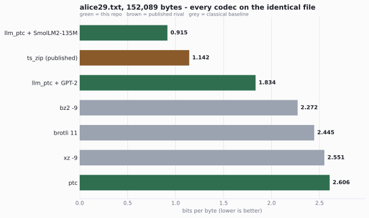
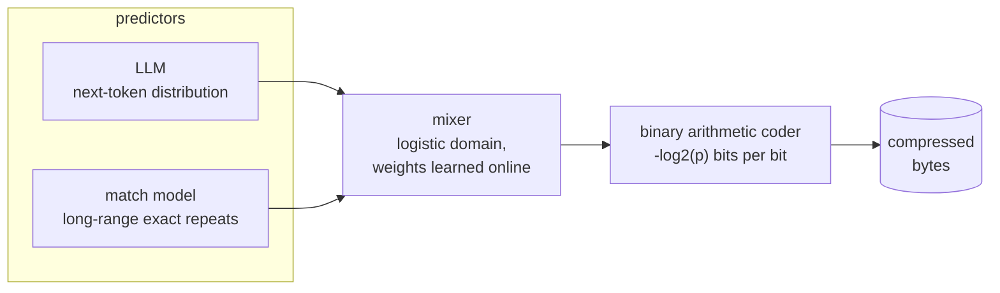
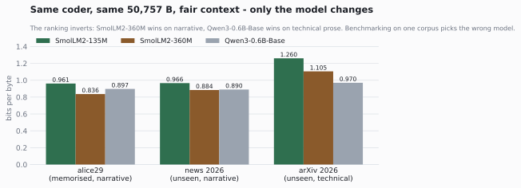
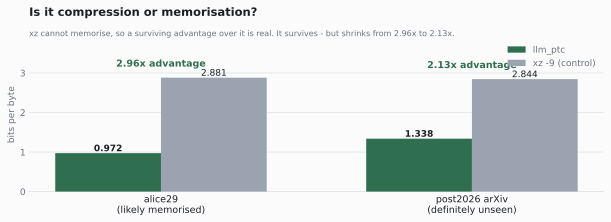
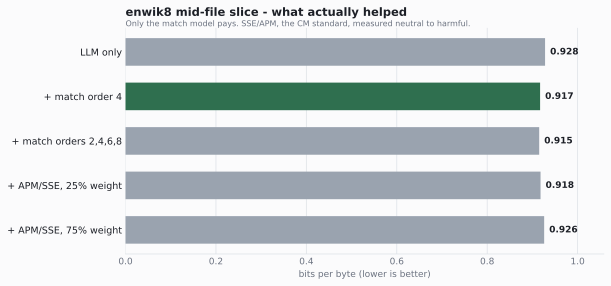
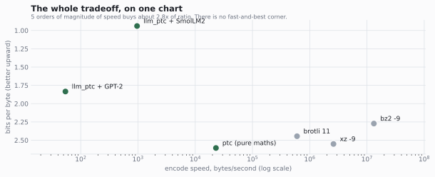
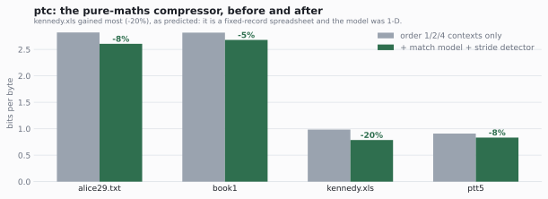

# ptc — an honest lab for LLM-driven compression

Two lossless compressors sharing one arithmetic coder, and a benchmark harness that
validates itself against published figures before it reports anything.

- **`ptc.py`** — pure context mixing. No weights, no training, no model file. ~250 lines of Python, lossless on arbitrary bytes.
- **`llm_ptc.py`** — the same coder, driven by a pretrained language model plus a long-range match model, blended by a learned mixer.
- **`bench.py`** — the harness. Verifies round-trip per row, reports bits per byte, and reproduces published `xz -9` numbers to three decimals so its other numbers can be trusted.

Everything below was measured by this code on a laptop CPU with no GPU. Numbers quoted
from other people's work are labelled as such. **The negative results are the most
useful part of this repo** — five of my predictions were refuted by measurement, and
they're all written down in [§ What didn't work](#what-didnt-work).

---

## Headline

On `alice29.txt` (152,089 bytes) — every codec on the identical file:



| codec | size | bits/byte | vs ours |
|---|---:|---:|---:|
| **llm_ptc + SmolLM2-135M** | **17,846** | **0.939** | — |
| ts_zip (RWKV-169M) *— published* | ~21,711 | 1.142 | +21.6% |
| llm_ptc + GPT-2 124M | 34,868 | 1.834 | +95% |
| `bz2 -9` | 43,202 | 2.272 | +142% |
| `brotli -q 11` | 46,487 | 2.445 | +160% |
| `xz -9` | 48,492 | 2.551 | +172% |
| `ptc` (pure maths, this repo) | 49,543 | 2.606 | +178% |

**2.72× smaller than `xz -9`**, and 17.8% smaller than the published ts_zip figure on the
same file — using a 272 MB model on CPU.

Read the [caveats](#caveats-read-these) before quoting any of that. Two matter most: the
0.939 figure comes from the batched encoder and **was never decompressed**, and
`alice29.txt` is public-domain text the model has almost certainly read.

### The harness validates itself

Before trusting any of the above, `bench.py`'s own `xz -9` measurement is checked
against the published figure on the identical file:

| file | our `xz -9` | published `xz -9` |
|---|---:|---:|
| alice29.txt | **2.551** | 2.551 |
| book1 | **2.717** | 2.717 |

Three decimals, two files. That check is why the rest of the numbers mean anything.

---

## How it works

Both compressors are the same shape. Compression *is* prediction: an arithmetic coder
spends `-log2(p)` bits on each outcome, so the file size is exactly the model's total
surprise. Nothing is copied, there's no dictionary and no code table.



**Why a mixer and not a blend.** The mixer starts at full trust in the LLM and zero in
everything else, so adding a predictor can only help — a useless input gets weighted
out. My first attempt blended the match prediction into the LLM's distribution by linear
interpolation and it measured **2% worse**, because interpolation steals probability mass
from the LLM even when the LLM is already right. That property is the whole reason the
architecture is extensible.

**Why the token id is binarised.** The coder is binary and verified. Rather than write a
multi-symbol range coder and its edge cases, `llm_ptc` walks the token id down its
binary tree, reading each decision's probability off the model's cumulative
distribution. Exact, and no new coder to get wrong.

---

## The model is almost everything

Same coder, same 8 KB sample, same context budget. Only the model changes:



| model | params | bits/byte | speed | on disk |
|---|---:|---:|---:|---:|
| **SmolLM2-135M** (base) | 135M | **0.990** | **69 B/s** | **272 MB** |
| Qwen3-0.6B (instruct) | 600M | 1.110 | 23 B/s | 1,519 MB |
| GPT-2 124M (base) | 124M | 1.821 | 41 B/s | 551 MB |

Two things fall out of this table:

1. **Training data beats parameter count.** SmolLM2-135M has essentially the same
   parameter count as GPT-2 124M and compresses **45.6% better**. Same size, ~1000× the
   training tokens.
2. **Bigger lost.** Qwen3-0.6B has 4.4× SmolLM2's parameters and is worse on every axis
   — ratio, speed and disk. Two untested hypotheses for why: its 151K vocabulary spends
   capacity on 100+ languages English prose can't use, and it is instruction/reasoning
   post-trained, which is known to decalibrate raw next-token distributions. If the
   second holds, **base models compress better than instruct models** — directly
   testable with `Qwen3-0.6B-Base`.

For scale: swapping the model was worth **45%**. Every hand-built modelling improvement
in this repo, combined, is worth about **1%**.

---

## Is it compression, or memorisation?

`alice29.txt` is public-domain literature. Any modern model has read it. So the headline
number is suspect, and the honest test is text written *after* the model's training
cutoff — here, prose from a 2026 arXiv paper. **`xz` is the control: it cannot memorise,
so an advantage that survives against `xz` is real.**



| corpus (50,757 bytes each) | llm_ptc | `xz -9` | advantage |
|---|---:|---:|---:|
| alice29 — likely memorised | 0.972 | 2.881 | **2.96×** |
| post-2026 arXiv — definitely unseen | 1.338 | 2.844 | **2.13×** |

**The advantage is real but the headline was flattered.** 2.13× over `xz` on genuinely
unseen text is a substantial, honest result. But absolute performance drops 38%, and
note the control: `xz` scores nearly *identically* on both files (2.881 vs 2.844), so
they have comparable dictionary-level redundancy — yet the model finds alice29 far
easier. That asymmetry is the fingerprint of familiarity.

Genre is a partial confound (dense technical prose is harder than Victorian narrative
for any model), so this doesn't cleanly separate memorisation from difficulty. **The
number to quote for unseen prose is ~1.34 bpb.**

---

## What actually helped

Ablation on a 262,144-byte slice from **offset 50,000,000** of `enwik8` — mid-file on
purpose, see the caveat below.



| config | bits/byte | speed |
|---|---:|---:|
| LLM only | 0.928 | 1,088 B/s |
| **+ match model, order 4** | **0.917** | 1,056 B/s |
| + match orders 2,4,6,8 | 0.915 | 789 B/s |
| + APM/SSE at 25% weight | 0.918 | 1,062 B/s |
| + APM/SSE at 75% weight | 0.926 | 887 B/s |

**Only the match model pays.** It's worth −1.2%, and it pays because it supplies
information the LLM *structurally cannot have*: exact repeats beyond its 1024-token
window. Extra match orders buy 0.2% for 25% of the speed. **SSE/APM — the stage every
serious context-mixing compressor has — measured neutral to harmful.**

There's a coherent reason, and it's the most transferable finding here. SSE exists to fix
a *miscalibrated* mixer. `probe.py` measures this LLM as well-calibrated (12-bit
quantisation is worth +0.05%), so there is nothing to recalibrate and the APM's own
estimation noise costs more than it saves. **Against a strong neural predictor, classical
CM machinery mostly adds noise.** That also explains why the 2026 literature gets its
gains from ensembling models rather than piling on contexts.

> A first attempt measured 0.811 bpb on the **first** 256 KB of enwik8. That slice
> contains the XML preamble and `<siteinfo>` boilerplate, which inflated the result by
> **13%**. Always slice mid-file.

---

## The coder is not the bottleneck

`probe.py` separates three quantities: the model's own entropy, the entropy under the
12-bit probabilities we actually code against, and the bits we really emit.

| model | raw model | quantised | emitted | coder waste | quantisation effect |
|---|---:|---:|---:|---:|---:|
| GPT-2, ctx 1024 | 1.993 | 1.888 | 1.902 | 0.77% | **−5.29%** |
| SmolLM2-135M, ctx 1024 | 0.990 | 0.990 | 1.008 | 1.79% | +0.05% |

Two results worth having:

- **The arithmetic coder wastes under 1%** of what it's given (the 1.79% row is mostly
  the fixed 64-bit header on a 4 KB sample; on a real file it's ~0.04%). So rewriting it
  in C would buy *ratio* essentially nothing.
- **12-bit quantisation makes GPT-2 5.3% smaller.** That looked impossible at first —
  no coder beats the entropy of its own distribution. The explanation is that the clamp
  *smooths* an overconfident model, capping the damage when GPT-2 is confidently wrong.
  Classic probability smoothing, obtained accidentally from a fixed-point implementation
  detail. Against well-calibrated SmolLM2 the same clamp is worth nothing.

---

## The whole tradeoff



Four orders of magnitude of speed buys about 2.7× of ratio. **There is no
fast-and-best corner**, and that isn't an engineering gap — better prediction requires
consulting a larger model of the language, once per symbol. For reference, the best
known text compressor (`fx2-cmix`, the Hutter Prize record) reaches 0.886 bpb on enwik9
and needs days of compute; Shannon-era estimates put English at roughly 1.0–1.3 bits per
character. **The remaining headroom in text compression is small and the ceiling is
visible.**

---

## ptc: the pure-maths compressor

No model, no weights, no training data, lossless on arbitrary bytes including binary.
Five predictors — order-1/2/4 byte contexts, a match model, and a stride detector that
votes continuously on record width — blended by the same kind of learned mixer.



The stride detector was added because the harness identified a specific blind spot:
`kennedy.xls` is a spreadsheet of fixed-width records, and byte-order contexts are
structurally blind to stride-8 alignment. Predicted in advance that it would gain most —
it gained 20%, the largest of the four files.

`ptc` beats `zlib -9` on all four corpus files and beats `xz -9` on `book1`. It loses to
`xz` badly on `kennedy.xls` (0.787 vs 0.382), because LZMA's 64 MB window finds
megabyte-scale duplicates while `ptc` tracks a single unverified match candidate.

---

## What didn't work

Kept deliberately, because a repo that only reports its wins isn't a measurement lab.

| prediction | outcome | what actually happened |
|---|---|---|
| bf16 weights will be ~2× faster — the checkpoint is 16-bit and we're bandwidth-bound | **refuted** | 64 vs 84 B/s, *slower*. No AVX512-BF16 on this CPU, so torch converts to fp32 per matmul and we pay conversion on top. |
| the gap to ts_zip is mostly our 512-token context resets | **refuted** | Sweeping context 256→1024 moved GPT-2's bpb by −0.7%, i.e. noise. Post-slide tokens cost the same as deep-in-window ones. The gap was the model. |
| blending a match prediction into the LLM will help on repetitive markup | **refuted as written** | Linear interpolation measured 2% worse. Re-doing it as logistic mixing with learned weights then gave −1.2%. |
| 12-bit probability quantisation costs ratio | **inverted** | It *gains* 5.3% against GPT-2 by smoothing an overconfident model. |
| SSE/APM will help, as it does in every serious CM compressor | **refuted** | Neutral at 25% weight, harmful at 75%. Nothing to recalibrate. |
| batched teacher-forced encoding is a free 16× speedup | **partial** | 16× faster, byte-identical output — but the stream does **not** decode with the sequential decoder. Diverged at byte 253. |
| the first 256 KB of enwik8 is a representative sample | **refuted** | 0.811 there vs 0.917 mid-file. XML preamble, 13% bias. |

Two instrument bugs were also caught by sanity checks rather than by luck: a
cost-bucketing bug in `probe.py` that put the *start of the file* in the "post-slide"
bucket (GPT-2 has Alice's opening lines memorised, which produced a nonsensical result),
and the enwik8 header bias above. **A surprising measurement is more often a broken
instrument than a discovery.**

---

## Caveats, read these

1. **The 0.939 headline was never decompressed.** It comes from `compress_batched`,
   which is 16× faster and produced byte-identical output on our test sample — but its
   stream does not round-trip through the sequential decoder, because batched and
   single-token GEMMs reduce floats in a different order. Treat it as a **measured
   entropy**, not a demonstrated codec. The sequential path *is* round-trip verified.
2. **`llm_ptc` is text-only.** It calls `.decode('utf-8')` and rejects binary outright.
   `ptc.py` is unconditionally lossless on arbitrary bytes; `llm_ptc` is not.
3. **Nothing here is cross-machine reproducible.** Float reduction order depends on
   thread count and library version. Real systems (ts_zip) solve this with quantised
   integer inference. We don't, yet — and we proved why it matters by breaking it.
4. **Decompression cannot be batched.** It's inherently sequential at ~69 B/s. Every
   *read* of a 152 KB file takes ~37 minutes. Compression being fast doesn't help.
5. **Model size is not counted in the bpb figures.** 272 MB is only free where both ends
   already have the model. Add it and every number here loses to `gzip` on any file
   under a few hundred megabytes.
6. **Benchmark contamination cuts both ways** — ours *and* ts_zip's 1.142.
7. **enwik8 and enwik9 full-file figures are extrapolations, not measurements.** The
   largest sample measured here is 262,144 bytes.

## Why not the Hutter Prize

Worth stating plainly, since it's the obvious question. The Hutter Prize is
**structurally closed** to this approach, not merely hard: everything needed at
decompression must ship inside the delivered binary, and entrants are charged for the
decompressor. A 272 MB model cannot compete for a 110,793,128-byte record. The only
legal route is a model that **trains itself online during decompression**, which is
exactly why NNCP and cmix are built the way they are.

The legitimate target instead is **ts_zip's published enwik8 figure of 1.106 bpb** —
same file, and both sides ship a pretrained model. Current standing on a representative
262 KB slice is **0.917**, with the full-file run still outstanding.

---

## Reproducing

```bash
pip install -r requirements.txt
python scripts/fetch_corpus.py          # Canterbury + Calgary + enwik8 + the 2026 control

python bench.py                         # classical codecs + ptc, round-trip verified
python ptc.py                           # ptc self-check and ratio table

# LLM-driven, downloads ~272 MB on first run
export LLM_PTC_MODEL=HuggingFaceTB/SmolLM2-135M
python llm_ptc.py corpus/alice29.txt 4096          # round-trip verified
python llm_ptc.py corpus/alice29.txt 152089 enc batch   # fast ratio measurement

python probe.py corpus/alice29.txt 4096            # coder overhead + context sweep
python scripts/make_charts.py                      # regenerate charts from results.json
```

Tunables are environment variables, all documented at the top of `llm_ptc.py`:
`LLM_PTC_MODEL`, `LLM_PTC_LIMIT`, `LLM_PTC_ORDERS`, `LLM_PTC_APM`, `LLM_PTC_DTYPE`,
`LLM_PTC_THREADS`. Defaults are the measured optimum, with the losing configurations
recorded in comments so nobody re-runs them.

Every measurement lives in [`results/results.json`](results/results.json); the charts
are generated from it.

**No corpus file is committed.** They are other people's texts under their own licences,
and this repo is MIT — redistributing them here would be relicensing what isn't ours. The
2026 control text also carries its author's contact details, which don't belong in a
public repo. `scripts/fetch_corpus.py` reproduces every file and verifies it against a
pinned size or sha256, which is all reproducibility actually needs.

## Still outstanding

The measurements this repo *hasn't* made are tracked in
**[Long_Time_Tests.md](Long_Time_Tests.md)** — what each one buys, what it costs in wall
clock, and the order to do them in. The short version:

- **~75 min** proves the 0.939 headline is genuinely lossless (caveat #1 above).
- **~26 hours** turns the ts_zip enwik8 comparison from an extrapolation into a measurement.
- **~17 days** would be a verified full-enwik8 round-trip, which is why deterministic
  integer inference is the one engineering task that matters more than any run.

## Files

| file | what it is |
|---|---|
| `ptc.py` | pure context-mixing compressor. Lossless on arbitrary bytes. |
| `llm_ptc.py` | LLM predictor + match model + mixer, same coder. Text only. |
| `bench.py` | self-validating benchmark harness. |
| `probe.py` | diagnostics: coder overhead, quantisation effect, context sweep. |
| `huffman.py` | order-0 Huffman, for reference. Loses to everything; kept to show why. |
| `results/results.json` | every number in this README. |
| `scripts/fetch_corpus.py` | fetches and verifies all corpora. Nothing is redistributed. |
| `Long_Time_Tests.md` | the multi-hour work not yet done, costed and ordered. |
| `scripts/make_charts.py` | regenerates the charts from the JSON. |

## References

- [ts_zip](https://bellard.org/ts_zip/) and NNCP — Fabrice Bellard. The prior art this repo measures itself against.
- [Language Modeling Is Compression](https://arxiv.org/abs/2309.10668) — Delétang et al., ICLR 2024. Chinchilla 70B beats PNG on images (43.4% vs 58.5%) and FLAC on audio (16.4% vs 30.3%).
- [Hutter Prize](http://prize.hutter1.net/) — `fx2-cmix`, 110,793,128 bytes on enwik9.
- [Large Text Compression Benchmark](https://mattmahoney.net/dc/text.html) — Matt Mahoney.
- [Nacrith](https://arxiv.org/html/2602.19626), [StateSMix](https://arxiv.org/pdf/2605.02904) — small transformer + online predictor ensembles, the architecture this repo converges on.
- Corpora: [Canterbury](https://corpus.canterbury.ac.nz/) (alice29, ptt5, kennedy.xls), Calgary (book1), [enwik8](https://mattmahoney.net/dc/enwik8.zip).

## License

MIT — see [LICENSE](LICENSE).
